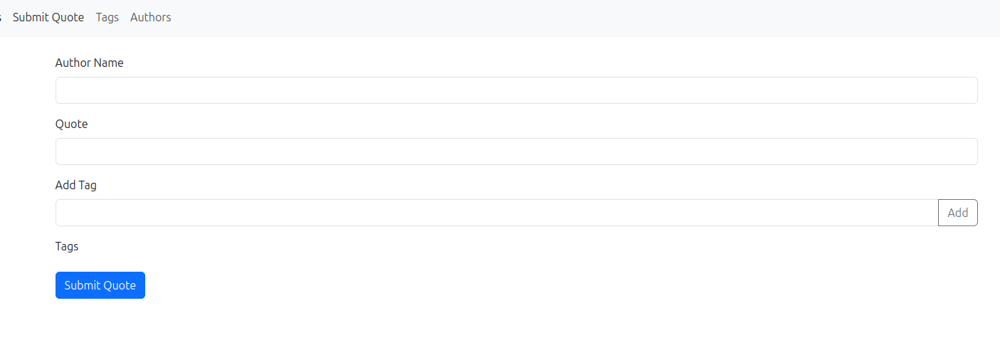
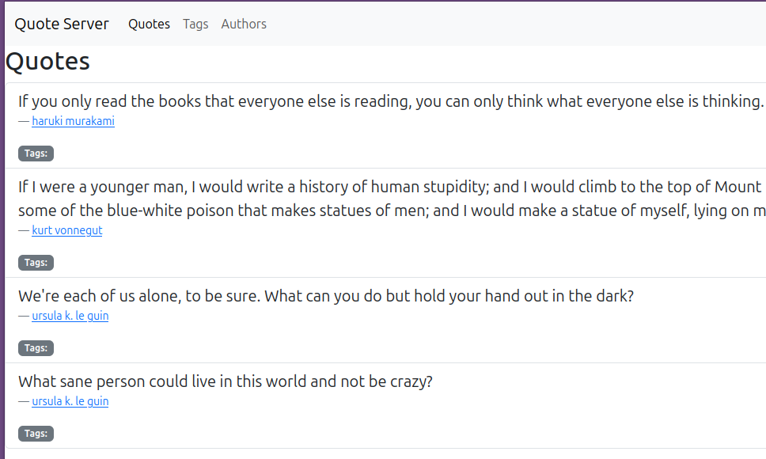
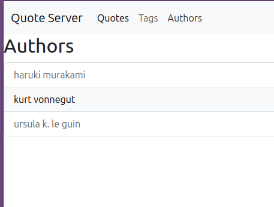
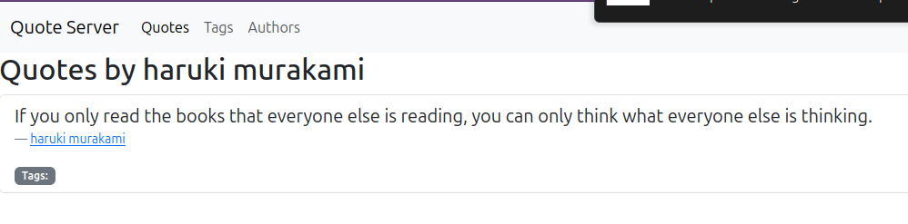

# Quote Front End
Creator: Sarah Dylan

A really simple front end designed to interact with quote-server back-end. I utilize
yew and yew-router to set up a simple SPA that allows you to read quotes from the database
and submit to the database.

## What I did and What went well

I have worked with React a good bit on previous projects so I immediately found yew comfortable. I think 90% of the hardship was
trying to parse how the callbacks/async functions worked. I had to keep going to the tutorial and retrying to write these functions
to get it to compile. I think if I were to use this again I would sit down and spend a lot more time parsing the documentation.

## Running the project
To run the project, you will need to have Rust and Cargo installed. Once you have those set up, you can run the following commands:

1. **Ensure you have trunk installed:**
   ```bash
   cargo install trunk
   ```

2. **Ensure you have wasm build target installed:**
   ```bash
   rustup target add wasm32-unknown-unknown
   ```
3. **Have Trunk watch the project:**
   ```bash
   trunk serve
   ```
4. **Open your browser:**
    Navigate to `http://localhost:8080` to view the application.

## Pictures

- Quote Submission Form  


- Quote List  


- Authors  


- Author Details  
